# Handlebar Drop Profile Aerodynamics — CFD Study

A computational fluid dynamics (CFD) comparison of 8 handlebar cross-section profiles to determine which geometry produces the least aerodynamic drag. This study was motivated by a practical question: which drop handlebar profile is actually most aerodynamic for road cycling?


## Background

Drop handlebars come in a wide variety of cross-sectional shapes, from simple round tubes to complex aero profiles with sharp noses, flat tails, and everything in between. Rather than relying on manufacturer marketing, I ran steady-state CFD simulations in OpenFOAM to compare 8 candidate profiles under realistic riding conditions. This was in collaboration with my partner Jake Sanchez, who has been modeling a new handlebar that he plans to manufacture himself. I have also run CFD on his handlebar models, though these results remain private until release. 


## Methodology

- **Solver:** OpenFOAM v2406 — `simpleFoam` (steady-state, incompressible RANS)
- **Turbulence model:** k-omega SST
- **Wind speed:** 12.5 m/s (~45 km/h) — representative of road/time-trial cycling
- **Iterations:** 500 (converged)
- **Reference length:** 23.8 mm
- **Reference area:** 7.14 × 10⁻³ m²
- **Fluid:** Air, kinematic viscosity ν = 1.5 × 10⁻⁵ m²/s

Each profile was meshed using `snappyHexMesh` from its STL geometry, run to convergence, and evaluated by its drag coefficient (Cd). Force coefficients were computed using OpenFOAM's `forceCoeffs` function object. Flow field slices were extracted at the mid-span cutting plane for visualization.


## Profiles Tested

| # | Profile | Description |
|---|---------|-------------|
| 1 | `sharp-nose-only` | Pointed leading edge, round trailing edge |
| 2 | `sharp-nose-sharp-tail` | Pointed at both ends (diamond-like) |
| 3 | `sharp-nose-rounded-tail` | Sharp nose, smoothly rounded tail |
| 4 | `sharp-nose-flat-tail` | Sharp nose, blunt flat tail |
| 5 | `basic-half-circle` | Semicircular cross-section |
| 6 | `truncated-circle` | Circle with flat trailing face |
| 7 | `cylinder` | Full circular cross-section (baseline) |
| 8 | `dfs-truncated-circle` | Modified truncated circle |

STL geometry files for all profiles are in the [`models/`](models/) directory.


## Results

Drag coefficients at the final iteration (t = 500), sorted best to worst:

| Rank | Profile | Cd |
|------|---------|-----|
| 🥇 1 | `truncated-circle` | **0.707** |
| 2 | `dfs-truncated-circle` | 0.714 |
| 3 | `cylinder` (baseline) | 0.746 |
| 4 | `sharp-nose-rounded-tail` | 0.758 |
| 5 | `sharp-nose-only` | 0.811 |
| 6 | `basic-half-circle` | 0.848 |
| 7 | `sharp-nose-flat-tail` | 0.991 |
| 8 | `sharp-nose-sharp-tail` | **1.250** |

The **truncated circle** achieved the lowest drag coefficient (Cd = 0.707), outperforming even the cylinder baseline and all "sharp nose" variants. The `dfs-truncated-circle` was a close second at 0.714.

A key finding: a sharp nose alone does not reduce drag. The `sharp-nose-sharp-tail` profile was the worst performer by a wide margin (Cd = 1.250), nearly 2× the drag of the truncated circle. Tail geometry matters as much as, if not more than, the leading edge shape.

### Mesh Visualization

Mesh cross-sections extracted from ParaView (snappyHexMesh output, mid-span slice):

| Profile | Mesh |
|---------|------|
| `cylinder` | 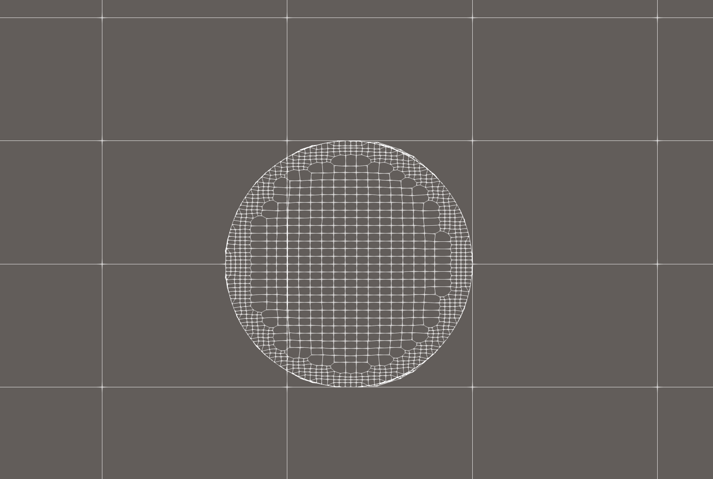 |
| `basic-half-circle` | 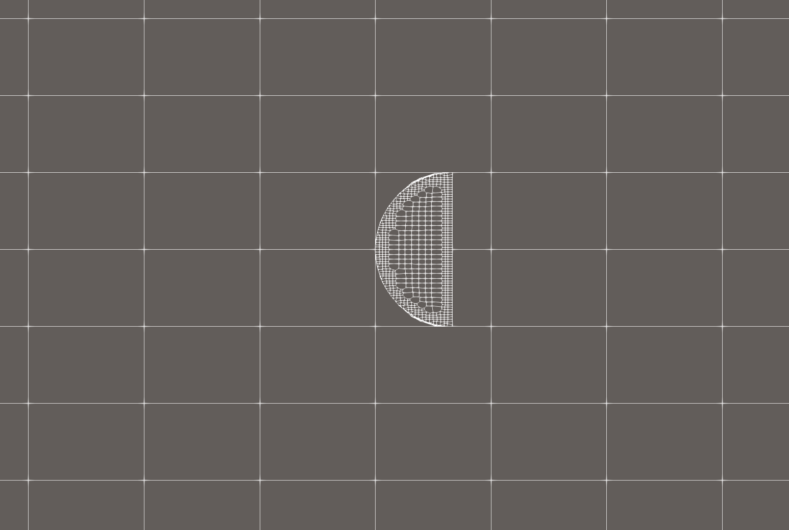 |
| `sharp-nose-flat-tail` | 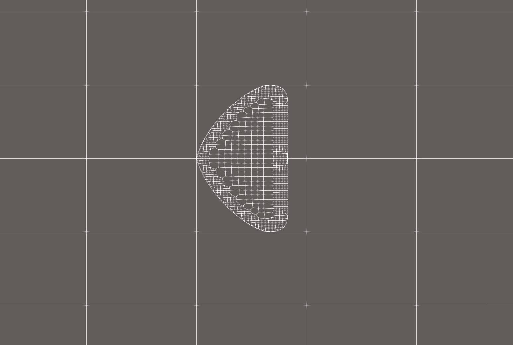 |
| `dfs-truncated-circle` | 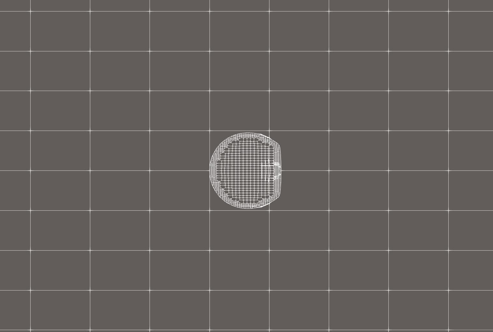 |
| `sharp-nose-only` | 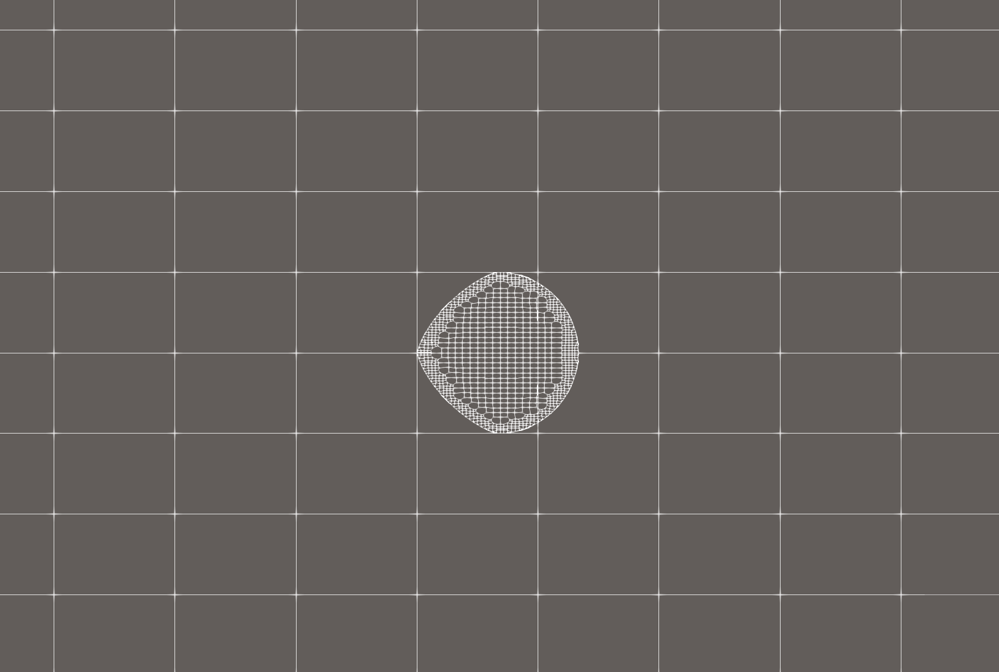 |
| `sharp-nose-sharp-tail` | 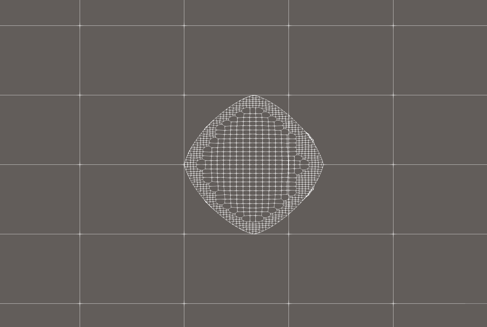 |
| `sharp-nose-rounded-tail` | 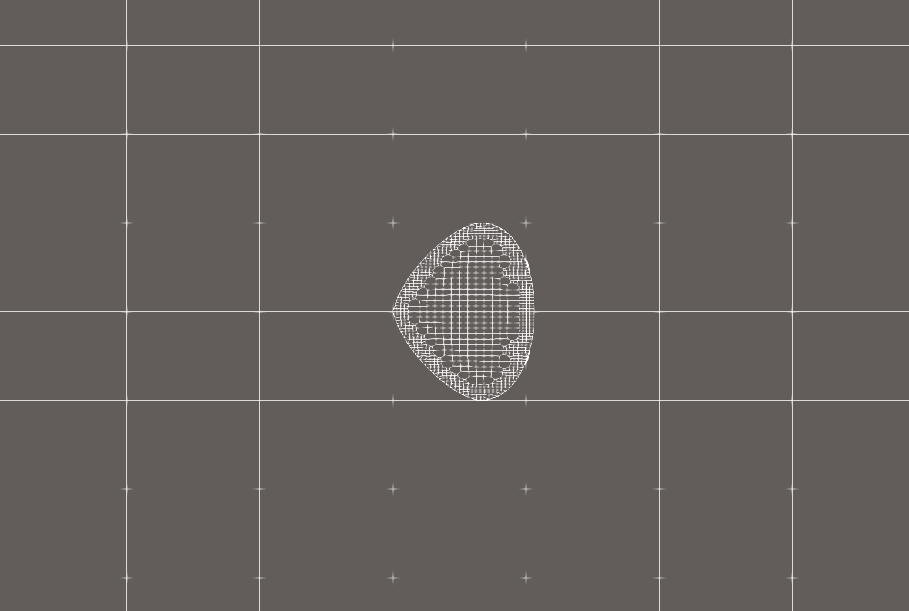 |
| `truncated-circle` | 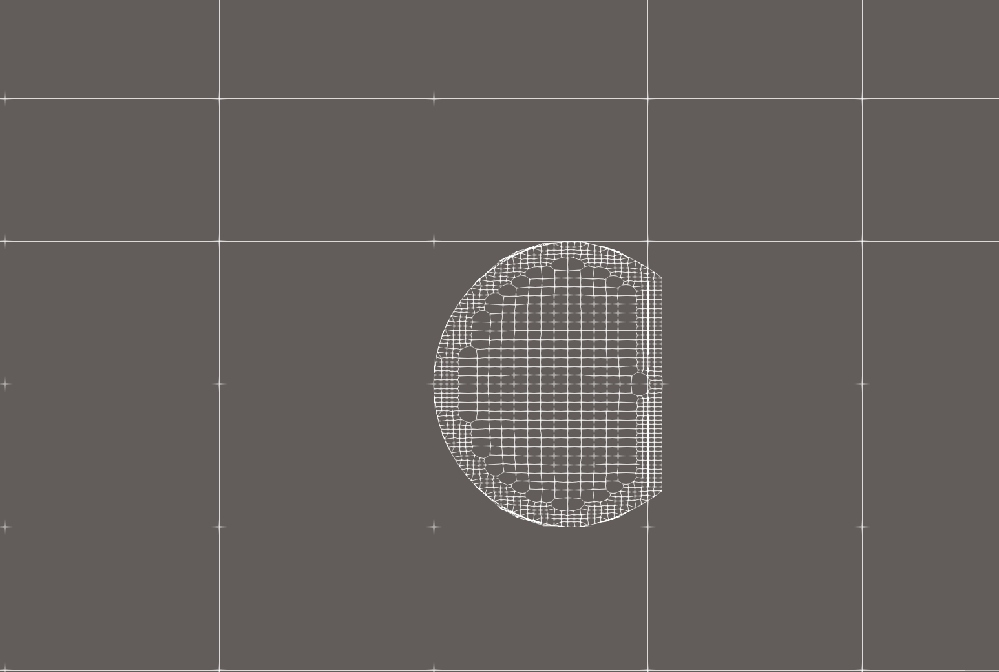 |


### Drag Visualization

| Profile | Drag |
|---------|------|
| `cylinder` | 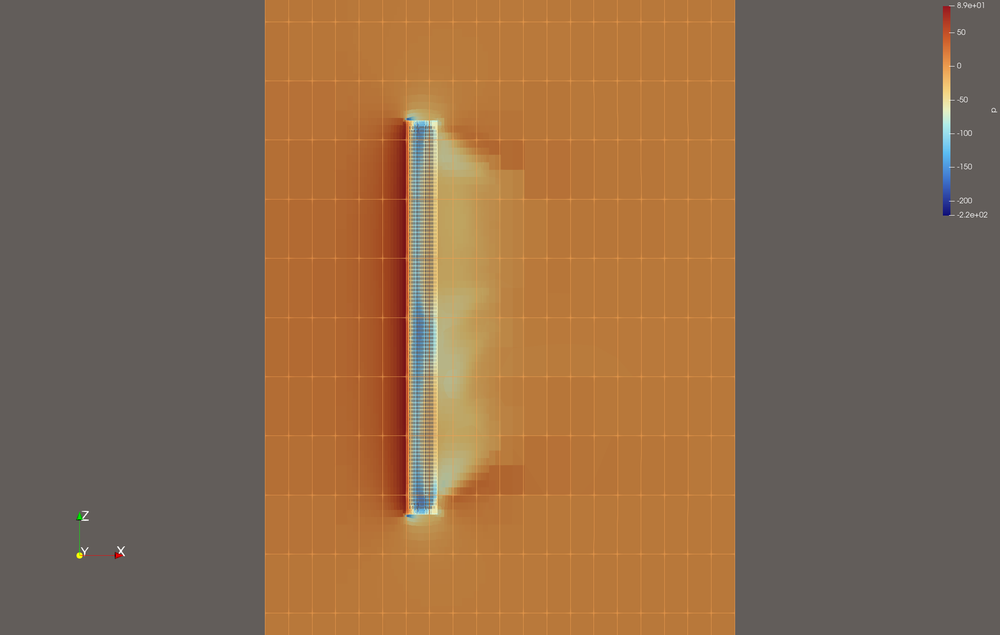 |
| `basic-half-circle` | 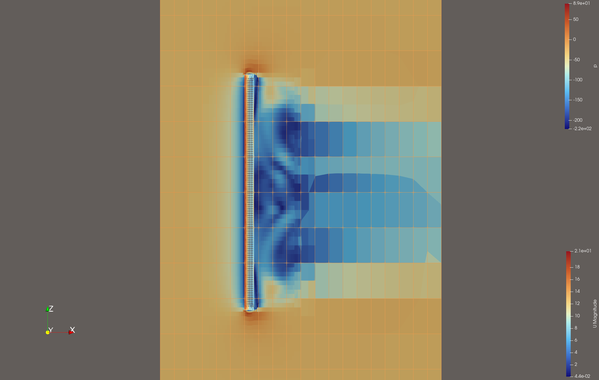 |
| `sharp-nose-flat-tail` | 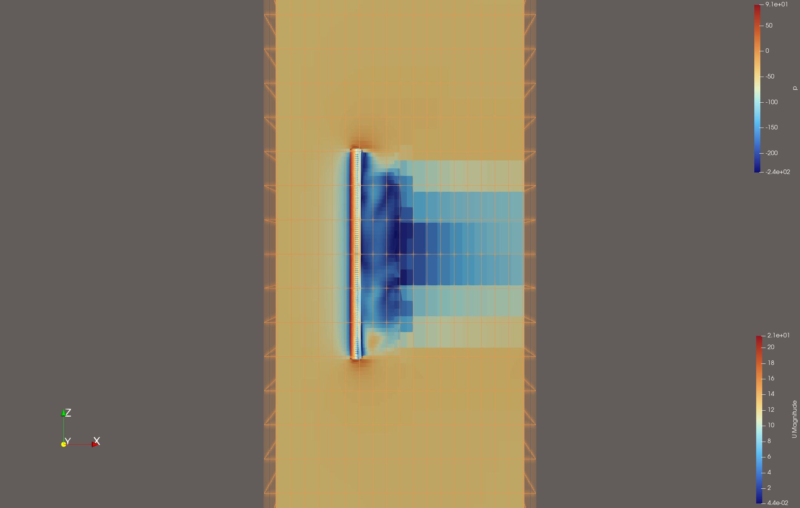 |
| `dfs-truncated-circle` | 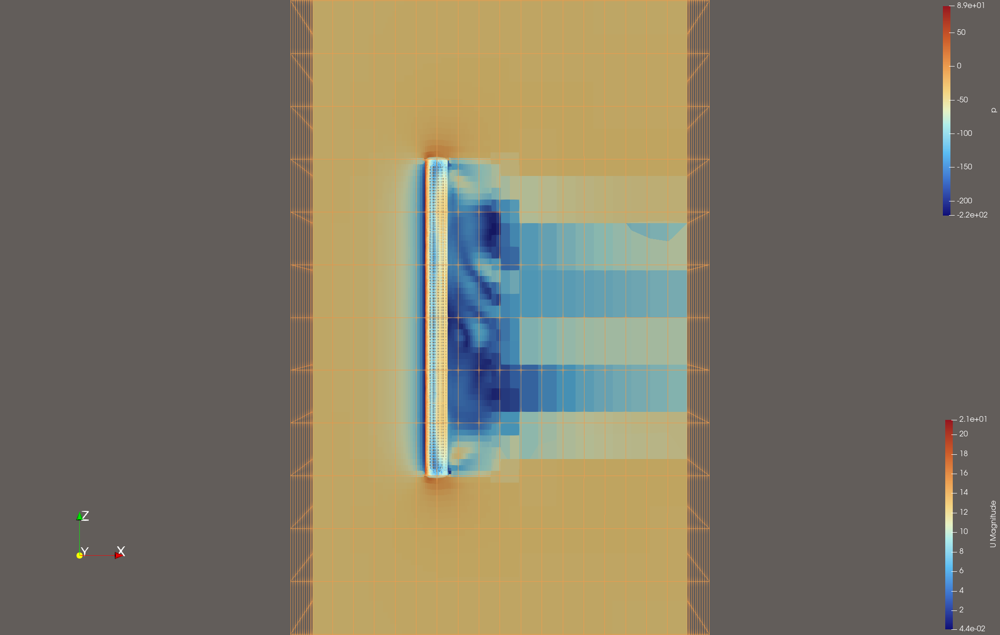 |
| `sharp-nose-only` | 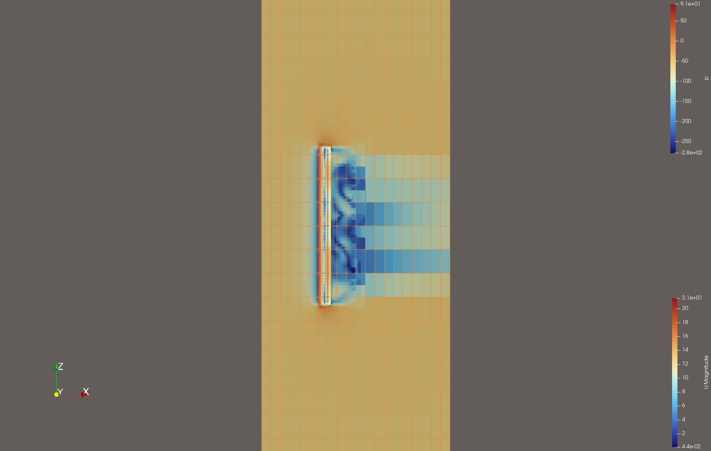 |
| `sharp-nose-sharp-tail` | 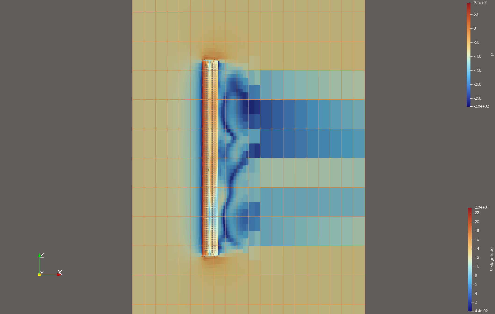 |
| `sharp-nose-rounded-tail` | 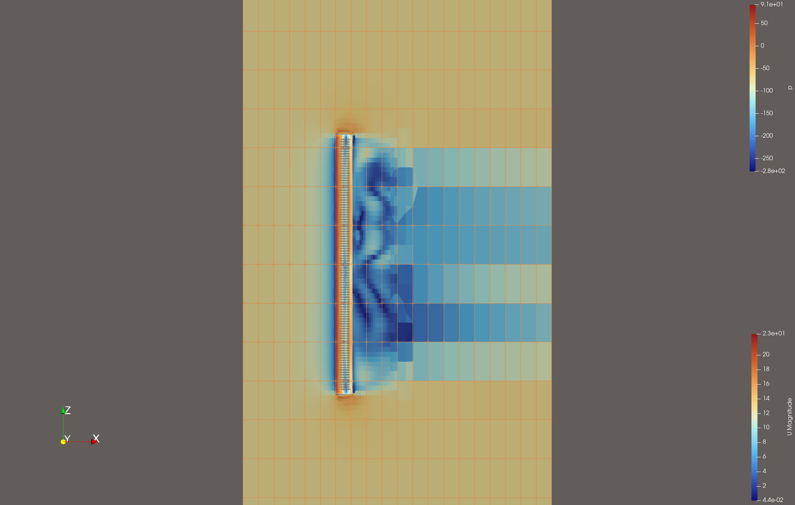 |
| `truncated-circle` | 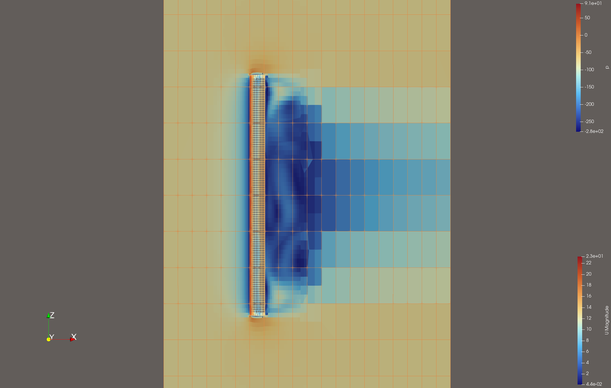 |


## Repository Structure

```
.
├── models/                        # STL geometry files for all 8 profiles
├── drop-profile-base/             # Base OpenFOAM case template
├── sharp-nose-only/               # Individual simulation cases
├── sharp-nose-sharp-tail/
├── sharp-nose-rounded-tail/
├── sharp-nose-flat-tail/
├── basic-half-circle/
├── truncated-circle/
├── cylinder/
├── dfs-truncated-circle/
└── experiment/                    # Additional experimental run
```

Each case directory follows the standard OpenFOAM structure:
- `constant/` — mesh and physical properties
- `system/` — solver settings, mesh generation, post-processing config
- `postProcessing/` — force coefficient history and cutting plane data
- `Allrun` — script to reproduce the simulation


## Tools

- [OpenFOAM v2406](https://www.openfoam.com) — CFD simulation
- [ParaView](https://www.paraview.org) — flow field visualization
